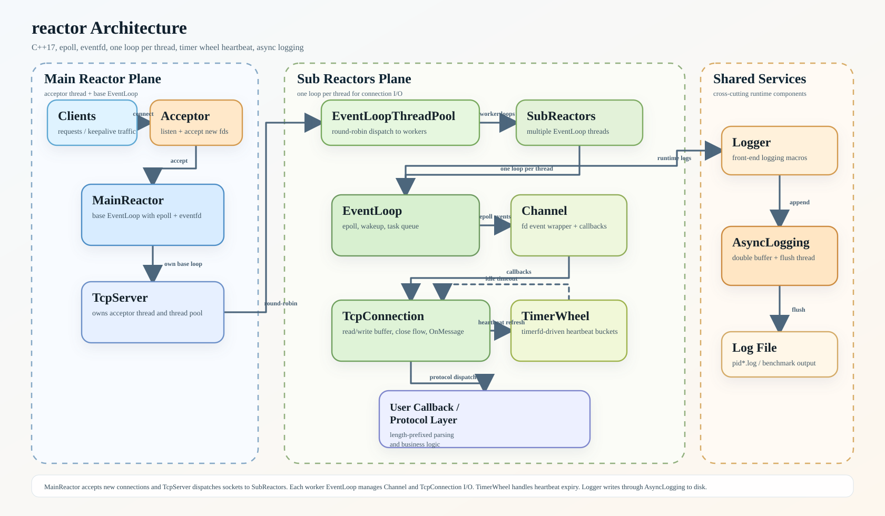

# reactor

一个基于 C++17 与 Linux I/O 多路复用机制实现的轻量级高性能网络服务器库。项目围绕 Reactor 模型展开，当前已经实现事件驱动网络层、跨线程任务唤醒、连接生命周期管理、时间轮心跳检测与异步双缓冲日志，并正在基于该框架继续演进高并发 KV 服务。



## 项目简介

这个项目聚焦于构建可扩展、可复用的服务端基础设施，而不是只实现一个单点业务程序。当前仓库已经具备以下技术特征：

- 基于 One Loop Per Thread 模型组织线程与事件循环
- 基于 epoll 封装 Reactor 核心组件：EventLoop、Channel、TcpConnection、TcpServer
- 使用 eventfd 完成跨线程任务投递与唤醒
- 使用 timerfd + 时间轮实现连接保活与超时回收
- 使用现代 C++ 重写基础设施，覆盖智能指针、线程、互斥锁、条件变量、原子变量等能力
- 提供异步双缓冲日志系统，支持全局单例模式

当前项目定位是高性能网络库；在此基础上，后续将继续实现高并发 KV 服务，规划支持自定义协议解析、分段锁内存存储、WAL 持久化与崩溃恢复。

## 架构概览

项目整体采用 Main Reactor + Sub Reactors 的多线程 Reactor 架构：

- MainReactor 负责监听端口、接收新连接
- TcpServer 持有一个 acceptor 线程和一个 EventLoopThreadPool
- Acceptor 在每次监听套接字可读时会持续 accept，直到 backlog 被排空
- 新连接建立后，由线程池按轮询策略分配到某个 SubReactor 所属的 EventLoop，并在该 owner loop 上完成连接初始化
- 每个 EventLoop 独立持有 epoll 实例，负责本线程内的 I/O 事件分发
- Channel 对文件描述符及其读写/错误/关闭回调进行封装
- TcpConnection 封装连接读写、发送缓冲、关闭流程与业务回调入口
- EventLoop 通过 eventfd 实现跨线程 Submit/WakeUp，避免直接跨线程操作非线程安全对象
- 当启用心跳功能时，SubReactor 内部挂载 Timer，基于时间轮推进连接生命周期
- Logger/AsyncLogging 作为独立异步日志后端，将前台写入与后台刷盘解耦

更贴近代码实现的调用链可以概括为：

1. TcpServer 在独立 acceptor 线程中启动 baseloop，并挂载 Acceptor。
2. Acceptor 监听新连接，并在每次 EPOLLIN 中尽量排空监听 backlog。
3. 新连接先被分配到某个 SubReactor 的 EventLoop，再在该 owner loop 中构造 TcpConnection、注册心跳并激活读事件。
4. 连接上的可读/可写事件由该 EventLoop 所属线程处理，避免多线程直接竞争同一连接状态。
5. 若启用心跳机制，读事件会刷新 HeartBeatObj 到时间轮中，空闲连接由时间轮自然淘汰。
6. 日志通过 Logger 宏写入 AsyncLogging 后端，由后台线程集中刷盘；前台数据锁与后台唤醒路径分离，避免同线程重入与后台等待路径互相干扰。

架构图由根目录脚本 [generate_architecture_diagram.py](generate_architecture_diagram.py) 生成，默认输出到 [docs/architecture.svg](docs/architecture.svg)。

## 已实现功能

### 1. Reactor 网络层

- 封装 EventLoop、Epoll、Channel、Socket、INetAddress、Acceptor、TcpConnection、TcpServer 等核心组件
- 支持非阻塞 I/O 与事件分发
- 默认消息处理逻辑支持 4 字节大端长度头的简单拆包/回包示例

### 2. 多线程事件循环

- 基于 EventLoopThread 与 EventLoopThreadPool 实现 One Loop Per Thread 模型
- 新连接可由线程池轮询分发到不同 I/O 线程
- 通过线程封闭减少共享状态竞争

### 3. 跨线程任务调度

- EventLoop 内部使用任务队列保存跨线程提交的回调
- 使用 eventfd 唤醒阻塞中的 epoll_wait，保证跨线程任务能够及时执行
- TcpConnection 的 Write/Close 等操作支持自动切回所属 I/O 线程执行

### 4. 时间轮心跳与连接回收

- 基于 timerfd 驱动 Tick
- 使用时间轮维护连接活跃性
- 结合 HeartBeatObj 生命周期管理实现空闲连接超时回收
- 新连接的首次心跳注册已经迁移到 owner loop 上完成，避免高并发下跨线程异步注册被延迟
- 项目中已提供混合心跳压力脚本，用于验证活跃连接保活与静默连接超时行为

### 5. 异步日志系统

- 提供 Logger + AsyncLogging 组合
- 前台线程只负责追加日志到缓冲区，后台线程集中刷盘
- 使用双缓冲思路降低前台线程写日志时的阻塞
- 在缓冲队列达到上限时支持丢弃新日志，避免无限制堆积
- 数据缓冲互斥与后台线程唤醒路径已经拆分，ThreadSanitizer 下的独立日志压测可通过

### 6. 工程与测试辅助

- 使用 CMake Preset 管理基础构建入口
- test 目录下提供默认服务端示例、日志压测脚本、普通连接压测脚本、混合心跳压力脚本
- 仓库内包含 FlameGraph 工具目录，便于后续做 perf 采样分析

## Benchmark 数据

当前仓库中已经有明确输出结果的一组 benchmark 来自异步日志系统压测脚本 [test/start_logger_stress_test.sh](test/start_logger_stress_test.sh)。

测试参数：

- 线程数：8
- 压测时长：30 秒
- 单条 payload：128 bytes

实测输出：

| 指标 | 数值 |
| --- | --- |
| produced_logs | 24,454,719 |
| enqueue 吞吐 | 815,157 logs/sec |
| flush 吞吐 | 815,075 logs/sec |
| 刷盘带宽 | 165.363 MB/s |
| 最终日志文件大小 | 5,202,395,136 bytes |

对应脚本输出如下：

```text
[INFO] Compiling logger_stress.cpp ...
[INFO] thread_count=8 duration_seconds=30 payload_bytes=128
[INFO] macro logger output will be renamed to logger_stress.log after run
[INFO] thread_count=8 duration_seconds=30 payload_bytes=128 log_path=pid1006414.log macros=ADACHI_LOG_INFO|ADACHI_LOG_WARNING|ADACHI_LOG_ERROR
[enqueue] produced_logs=24454719 duration_ms=30000 logs_per_sec=815157
[flush] file_size_bytes=5202395136 duration_ms=30003 logs_per_sec=815075 mb_per_sec=165.363
[PASS] logger stress completed
[INFO] final log file=logger_stress.log
```

除上述 benchmark 外，仓库还提供以下可复现实验入口：

- [test/start_stress_test.sh](test/start_stress_test.sh)：基础并发连接压力测试
- [test/start_heartbeat_mixed_stress_test.sh](test/start_heartbeat_mixed_stress_test.sh)：活跃连接 + 静默连接混合心跳压力测试

这些脚本当前更偏向功能稳定性验证，README 暂不虚构未落地的吞吐数据。

## 并发校验

最近一轮基于 ThreadSanitizer 的并发校验，已经覆盖日志库与心跳链路的关键路径。

已确认通过的验证包括：

- 独立日志压测：单线程与多线程模式下，基于 `test/logger_stress.cpp + src/logger.cpp` 的 TSAN 压测可完成并输出 `PASS`
- TSAN 服务端 + 混合心跳压测：`build/test` 在 `ENABLE_TSAN=ON` 下可通过 `test/start_heartbeat_mixed_stress_test.sh`
- 混合心跳压测目标指标：`active_replied=2000/2000`、`active_closed_during_phase=0`、`active_closed_after_stop_in_range=2000/2000`、`silent_closed_in_range=8000/8000`

这一轮修正主要集中在三件事：

- 新连接初始化迁移到目标 owner loop，避免“先 accept、后跨线程补初始化”导致的时间窗口问题
- Acceptor 在单次可读事件中排空监听 backlog，避免大批连接延迟进入心跳计时窗口
- AsyncLogging 将数据互斥与后台唤醒拆分，避免前台追加与后台等待在 TSAN 下形成虚假或真实的重入锁竞争

## 构建方式

### 仓库包含范围说明

仓库主要提交源码、构建脚本与测试脚本；部分目录或运行产物需要你在本地自行执行命令后生成，并不默认随仓库一起上传。

通常需要本地生成的内容包括：

- `build/`：执行 CMake Preset 配置与编译后生成的构建目录
- `test/` 目录下由脚本临时编译出的压测二进制：如 `logger_stress`、`stress_client`、`heartbeat_mixed_stress_client`
- 运行压测后生成的日志文件：如 `pid*.log`、`logger_stress.log`
- 如仓库中未携带架构图产物，可通过脚本重新生成 `docs/architecture.svg`

因此，README 中提到的可执行文件、构建目录和日志结果，默认都应理解为“本地执行后生成的产物”，而不是直接随源码仓库提供。

### 环境要求

- Linux
- CMake 3.19+
- Ninja
- 支持 C++17 的编译器
- 已正确配置 `VCPKG_ROOT` 环境变量

> 当前仓库在 [CMakePresets.json](CMakePresets.json) 中默认通过 `VCPKG_ROOT` 引用 vcpkg toolchain，如本地路径不同，需要自行调整。

### 使用 CMake Preset 构建

```bash
cmake --preset default
cmake --build build
```

如需启用 ThreadSanitizer：

```bash
cmake --preset tsan
cmake --build build
```

基础构建会生成：

- 静态库 `adachi`
- 示例可执行文件 `test`

其中 `build/` 目录本身是本地生成目录；如果你刚克隆仓库但还没有执行构建命令，这是正常情况。

默认服务端示例位于 [test/test.cpp](test/test.cpp)，当前监听 `127.0.0.1:12345`，并启用了时间轮心跳参数 `{10, {1, 0}}`。

### 运行示例程序

```bash
./build/test
```

### 运行日志压测

```bash
./test/start_logger_stress_test.sh
```

该脚本会在本地临时编译 `test/logger_stress.cpp`，并在运行后生成日志文件；这些二进制与日志文件不属于源码仓库的固定内容。

如需直接验证日志库的 TSAN 行为，可参考下面这种本地命令：

```bash
g++ -O1 -g -std=c++17 -Wall -Wextra -Werror -fsanitize=thread -fno-omit-frame-pointer -pthread -I./include test/logger_stress.cpp src/logger.cpp -o test/logger_stress_tsan
TSAN_OPTIONS=halt_on_error=1:second_deadlock_stack=1 ./test/logger_stress_tsan 8 5 128
```

### 运行基础连接压测

```bash
./test/start_stress_test.sh
```

该脚本会在本地编译 `client` 与 `stress_client` 后再执行压测。

### 运行混合心跳压测

先启动服务端，再执行：

```bash
./test/start_heartbeat_mixed_stress_test.sh
```

该脚本会在本地编译 `heartbeat_mixed_stress_client` 后执行，不依赖仓库预置二进制。

如需在 TSAN 构建下复现实验，可先启动：

```bash
TSAN_OPTIONS=halt_on_error=1:second_deadlock_stack=1 ./build/test
```

然后在另一个终端执行混合压测脚本。

### 生成架构图

```bash
python3 ./generate_architecture_diagram.py
```

如果仓库中没有现成的 `docs/architecture.svg`，或者你修改了图形脚本，希望得到最新版本的架构图，就需要手动执行这一步。

如需自定义输出路径：

```bash
python3 ./generate_architecture_diagram.py --output docs/architecture.svg
```

## 后续计划

在当前 Reactor 网络库的基础上，下一阶段将重点推进高并发 KV 服务能力：

- 接入自定义协议解析，完善请求编解码与命令分发
- 实现面向高并发访问的内存 KV 存储结构
- 引入分段锁或更细粒度并发控制，提升多线程读写扩展性
- 增加 WAL 持久化能力
- 支持崩溃恢复与数据重放
- 补充更系统的 benchmark，包括网络层吞吐、延迟、连接规模与恢复时间等指标
- 结合 perf / FlameGraph 持续分析热点路径，迭代优化日志、网络收发与协议处理链路

## 目录说明

- [include](include)：核心头文件
- [src](src)：核心实现
- [src/timer](src/timer)：时间轮与心跳对象实现
- [test](test)：示例程序、客户端源码与压测脚本；部分脚本会在本地临时编译测试二进制
- [FlameGraph](FlameGraph)：性能分析辅助工具
- [docs](docs)：README 引用的生成型文档资源；如图文件缺失可通过脚本重新生成
- [prompt](prompt)：本地提示词与协作记录；通常不是项目运行必须文件，也不一定会随仓库分发
